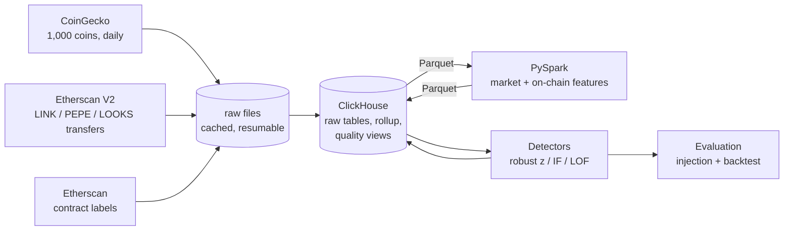

# ChainSignal

A batch pipeline for crypto market and on-chain anomaly detection. It pulls one year of daily market data for the top 1,000 coins (CoinGecko) and every on-chain transfer of three tokens over 90 days (Etherscan), stores it in ClickHouse, engineers features with PySpark, and compares three anomaly detectors: a robust z-score, Isolation Forest and Local Outlier Factor. There are no labels, so the detectors are evaluated with planted synthetic anomalies and a backtest against independently documented events.

The target pattern is **wash trading**: volume that rises without the price movement or new participants that real demand would bring.

## Results at a glance

| | |
|---|---|
| Data | 1,000 coins × 365 days (319,158 rows); 1,638,924 ERC-20 transfers of LINK, PEPE and LOOKS |
| Load verification | row counts, key uniqueness and an exact 256-bit checksum of every transfer value match the raw files (15/15) |
| Data quality | 83 coins excluded (feed glitches, stale feeds); 921 one-day volume collapses removed |
| Detector agreement | z-score vs Isolation Forest overlap 0.73; LOF vs either 0.11 |
| Synthetic recall at a 1% alert budget | 12σ combination anomalies: Isolation Forest **43%**, z-score 11%; 24σ all types: IF 99%, z-score 85%, LOF 17% |
| Backtest | Resolv USR depeg flagged by all three on the documented date; Kelp DAO hack missed (token price held) |
| Strongest wash-trading candidate | Celer Network, 2026-06-03: **$1.5B traded on an $18M market cap**, price flat; confirmed by a second aggregator |
| Tests | 55 (unit, Spark, live-database, and one regression test per bug fixed) |

Every number above is reproduced by `scripts/insights.py` (output in [docs/results/insights.txt](docs/results/insights.txt)).

## Interactive dashboard

[docs/dashboard/](docs/dashboard/) is a single-page explorer: pick any of 165 coins and see its price, volume and the days each detector flagged (with why), plus the data-quality examples, the model comparison, the wash-trading candidates, the on-chain view and the evaluation. Every number comes from `scripts/build_dashboard.py`, which exports `data.json` from the analysis database. To view it locally: `cd docs/dashboard && python -m http.server`, then open http://localhost:8000.

## Architecture



Batch, not streaming: data is pulled on a schedule, every load is a full idempotent reload from the raw files, and every stage verifies its output against the previous one.

## Design decisions

**Ingestion around real API limits.** CoinGecko's free tier allows 10,000 calls a month, so every response is cached and a 1,000-coin pull costs ~1,000 calls once. Etherscan's free tier returns at most 1,000 records per request, so transfers are paged by **block range** rather than page number: the last block of every batch may be cut off, so it is dropped and re-requested. Only complete blocks are written, which gives no duplicates, no gaps and an exact resume point. Three failure modes found in production runs are now guarded against: no `logIndex` in Etherscan V2 responses, crashes during API slowdowns, and an API answer that silently ended a pull two days early.

**Why ClickHouse.** The workload is append once, aggregate many times, which is what a columnar database is built for. Sort keys follow the queries: `(coin_id, date)` and `(token, block_time, …)`. Compression codecs were chosen by measurement: hashes and addresses were 68% of the bytes, and ZSTD with Delta codecs cut the transfers table from 173 MB to 96 MB while keeping them readable (binary storage reached 89 MB but made every query use `hex()`). Grouping all 1.64M transfers into address pairs takes under half a second on a laptop. The daily rollup is an explicit step, not a materialized view: a materialized view runs on every insert and would double-count on batch reloads.

**Data quality before modelling.** The largest "anomalies" in raw crypto data are feed errors:

- price glitches: bad prints, and Bittensor subnet tokens switching between TAO and USD quotes on the same dates;
- dead feeds: coins with zero volume on most days;
- one-day volume collapses: Bitcoin shows $0.38B on 2026-03-11, between days of $35–46B.

These are handled in SQL views over untouched raw tables, and every exclusion is visible in `coin_quality`. CoinGecko's daily point stamped day D holds day D−1's close; labelling it D shifted every date by one day until it was caught against a second source.

**Features without lookahead.** Every rolling statistic covers a trailing window that ends the day before the row it describes.

- Market features: z-scores of return, volume and turnover; correlation and beta with the market (median coin return); residual return; and `volume_price_gap`, which is high when volume is abnormal and price is not.
- On-chain features: wallet-to-wallet round-trip trades, new addresses, sender concentration, large transfers, and whether activity is growing faster than the number of participants.
- Round trips are counted between **wallets only**: 13,204 addresses were labelled with Etherscan, and 96–98% of back-and-forth transfers turned out to involve a contract (DEX pools, routers, bots). Without that separation the "wash trading" signal is mostly Uniswap.

**Robust z-scores, with a floor.** Mean and standard deviation gave a volume z of 201 when a coin's history was flat. Median and MAD fix the problem of one past extreme dragging the baseline, but still blew up (74,309) on stablecoins, where any tiny move is divided by an almost-zero MAD. A minimum scale (0.5% for returns, 10% for volume) fixes it.

## Model comparison

All three methods get the same four robust z-score features. Their scores are on different scales, so each flags exactly its top 1% of coin-days (2,545), and the methods are compared on what they flag.

| Share of flags by type | z-score | Isolation Forest | LOF |
|---|---|---|---|
| volume only (the wash-trading shape) | 36% | 30% | 26% |
| price and volume | 34% | 47% | 20% |
| price shock | 27% | 22% | 17% |
| multivariate only (no single feature extreme) | 0% | 0% | 24% |

- The z-score and Isolation Forest mostly agree on real data (overlap 0.73). Crypto's fat tails (2.8% of days beyond |z| = 3, ten times a normal distribution) fill the budget with large outliers, so a coin-day needs a robust |z| of 12.3 to make the top 1%.
- LOF adds a genuinely different view (overlap 0.11), mostly local and multivariate anomalies. LOF assumes no duplicate points, so near-identical points are merged (to 0.1σ) before fitting. Without that, 15% of its flags were ordinary days of flat assets.

## Evaluation

**Synthetic injection.** 887 anomalies (one per coin) were planted in the raw data and then sent through the real feature code. The strength is measured in each coin's own volatility.

| Recall at 1% budget | z-score | Isolation Forest | LOF | 2+ agree |
|---|---|---|---|---|
| 6σ, all types | 5% | 4% | 6% | 4% |
| 12σ, combo (price move on falling volume) | 11% | **43%** | 13% | 13% |
| 24σ, all types | 85% | **99%** | 17% | 85% |

- Isolation Forest's advantage is real, but specific to anomalies spread across several features.
- LOF misses large spikes: they land among other extreme points and look normal locally.
- Below ~12σ every method catches only a few percent at this budget.

**Backtest against documented events.**

| Event | Result |
|---|---|
| Resolv USR depeg, 2026-03-22 | ✅ −69% on the documented date, flagged by all three |
| Kelp DAO hack ($293M), 2026-04-19 | ❌ missed: rsETH's price held close to ETH, so price and volume data cannot see it |
| Maya Protocol CACAO exploit, 2026-08-18 | no data: CoinGecko's history ends a month earlier |
| February 2026 market crash | per-coin detectors barely react, by design; the market-return series scores −9.8 |
| 2026-08-21 rally (found by the data, confirmed afterwards) | the largest market-level move of the year (+12.3σ), matching a documented rally with $1.48B in short liquidations |

The event coins had fallen out of the current top 1,000 (**survivorship bias** in the universe), so they were fetched separately and added for the backtest.

## What the data said

- **Impossible turnover is real and rare.** Median daily turnover is 5.4% of market cap. Excluding pegged assets, 29 coin-days across 13 coins traded more than 10x their whole market cap with the price moving under 5%. Celer Network's $1.5B day on an $18M market cap appears identically in two independent aggregators. That much volume with no price impact cannot be genuine trading: it is consistent with wash trading or fake exchange-reported volume.
- **Back-and-forth transfers are almost entirely infrastructure.** 96% (LINK, PEPE) and 98% (LOOKS) involve a contract. Wallet-to-wallet round trips are about 1% of transfers.
- **Bots are a large share of on-chain activity.** 13.8% of PEPE transfers come through ERC-4337 `handleOps` (smart-contract wallets) and 8.8% through an unverified function typical of MEV bots.
- **Activity and participation can come apart.** LINK on 2026-08-31 had three times its normal transfers from an unchanged set of addresses. All three detectors flagged it as recycled activity. PEPE's busiest day, by contrast, brought new participants with it.
- **LOOKS, the token with a wash-trading history, is now nearly dormant:** a median of 28 transfers a day from 1,132 addresses in 90 days.

## Limitations

- **Survivorship bias:** the coin universe is today's top 1,000. Selecting by market cap at the start of the window would include coins that later collapsed.
- **Exploits that don't move the token's price are invisible** to market-data detectors (Kelp DAO). Protocol outflows on-chain would be needed.
- **Small anomalies go undetected:** below ~12σ the 1% budget is consumed by crypto's own extremes.
- **Smart-contract wallets** (Safe, ERC-4337) are labelled as contracts, so wash trading routed through them would be missed.
- **The on-chain sample is small:** 3 tokens, 90 days, ~236 scored token-days. Treat on-chain detector results as illustrative.
- **Flagged candidates are not verdicts.** Only Celer was checked against an outside source.

## Reproduce

Requires Docker, Python 3.11+, Java 17 or 21 (for Spark), and free CoinGecko Demo and Etherscan API keys.

```bash
cp .env.example .env                              # add COINGECKO_API_KEY and ETHERSCAN_API_KEY
docker compose up -d                              # ClickHouse on :8123 / :9000
python3.11 -m venv .venv && .venv/bin/pip install -r requirements.txt -e .
.venv/bin/python scripts/check_env.py             # ClickHouse, Spark + Python workers, keys

.venv/bin/python scripts/ingest_coingecko.py --coins 1000   # ~25 min, ~1,004 of 10k monthly calls, cached
.venv/bin/python scripts/ingest_etherscan.py --days 90      # resumable; per token: --tokens PEPE --rate 1.6
.venv/bin/python scripts/inspect_raw.py                     # samples and data-quality checks
.venv/bin/python scripts/load_clickhouse.py                 # load + verify against raw files
.venv/bin/python scripts/label_addresses.py                 # contract vs wallet, ~15 min, cached
.venv/bin/python scripts/load_clickhouse.py                 # reload with labels
.venv/bin/python scripts/build_features.py                  # ClickHouse -> Spark -> ClickHouse, verified
.venv/bin/python scripts/run_models.py                      # 3 detectors, comparison, anomaly_scores
.venv/bin/python scripts/evaluate.py                        # injection + backtest -> docs/results/
.venv/bin/python scripts/insights.py                        # every headline number
.venv/bin/python scripts/build_dashboard.py                 # dashboard data -> docs/dashboard/data.json
.venv/bin/pytest                                            # 55 tests (integration ones need ClickHouse loaded)
```

## Repository layout

```
src/chainsignal/
  ingest/       CoinGecko and Etherscan clients, block-range pagination, address labels, rate limiting
  db/           schema, rollup, quality views, feature and score tables (SQL); loader
  features/     PySpark market and on-chain features; Parquet bridge to ClickHouse
  models/       robust z, Isolation Forest, LOF; shared scoring pipeline; comparison helpers
  evaluation/   synthetic injection; backtest against documented events
scripts/        one entry point per stage (listed above)
tests/          unit, Spark, live-database and regression tests
docs/           build log (every step, bug and correction), results, interactive dashboard
```

| Table / view | Contents |
|---|---|
| `coins`, `market_daily_raw`, `token_transfers_raw`, `address_labels` | raw data |
| `market_daily_flagged` → `coin_quality` → `market_daily_clean` | cleaning layer (views) |
| `token_daily` | per-token daily rollup |
| `market_features`, `onchain_features` | Spark output |
| `anomaly_scores` | score, flag and votes from each detector per coin-day and token-day |

## Build log

[docs/build-log.html](docs/build-log.html) records every step of the build: what was done and why, the results, 10 bugs and the corrections they forced, including the ones that reached back into earlier stages.
